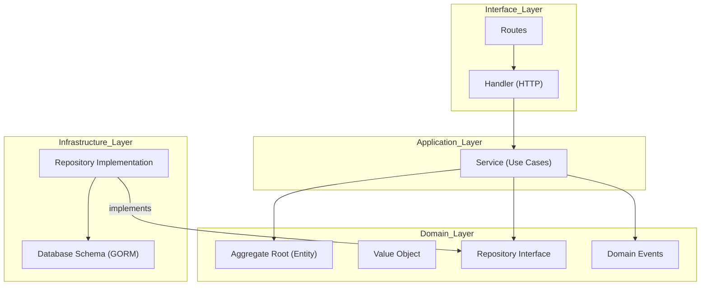

# Domain-Driven Design (DDD) Documentation

This document provides a comprehensive overview of the design patterns, code structure, and architectural decisions implemented in the `goWebService` project.

## 1. Architectural Style
The project follows a **Modular Monolith** approach based on **Clean Architecture** and **Domain-Driven Design (DDD)** principles. It emphasizes a strict separation between business logic and infrastructure concerns.

### High-Level Layers:
- **Interfaces / Presentation**: Handles HTTP requests, input validation (DTOs), and responses (`handler.go`, `routes.go`).
- **Application**: Orchestrates business use cases, handles transactions, and dispatches events (`service.go`).
- **Domain**: The core of the application. Contains business rules, entities, value objects, and repository interfaces (`user.go`, `product.go`).
- **Infrastructure**: Implements data persistence and external integrations (`repository.go` implementation, GORM schemas).

---

## 2. Component Structure & Relations

Each domain (Bounded Context) is self-contained within the `internal/` directory.

### Relationships Diagram (Mermaid)


### Correlation: Event-Driven Communication
Communication between different domains is handled asynchronously via **Domain Events** to ensure loose coupling.
1. **Entity** records an event (e.g., `UserCreated`).
2. **Service** persists the entity and triggers the **Dispatcher**.
3. **Bootstrap** registers cross-domain subscribers.

---

## 3. Design Decisions

### A. Separation of Persistence vs. Domain Models
One of the most critical decisions in this project is the decoupling of the **Domain Entity** from the **GORM Schema**.
- **Reasoning**: GORM tags and database-specific logic should not leak into the domain layer. This allows the business logic to evolve independently of the database structure.
- **Implementation**: The repository converts between `User` (Domain) and `userSchema` (Persistence) using `toDomain()` and `fromDomain()` mapping functions.

### B. Rich Domain Model
Instead of having "Anemic Entities" (just data holders), we use **Rich Entities**.
- **Logic Placement**: Validations and state transitions (e.g., `UpdateEmail`) happen inside the Entity, ensuring it is always in a valid state.
- **Value Objects**: Types like `Email` are encapsulated with their own validation logic, reducing duplication and improving type safety.

### C. Dependency Inversion
The **Application Layer** (Service) depends on the **Repository Interface** (Domain Layer), not the implementation. The actual implementation (GORM) is injected during application startup in `main.go`.

### D. Observability as First-Class Citizen
Tracing (OpenTelemetry) is integrated directly into the Service and Handler layers to provide deep visibility into request execution paths.

---

## 4. Comprehensive Project Structure

```text
.
├── cmd/api/            # Application Entry Point
│   └── main.go         # Dependency wiring & server bootstrap
├── config/             # Configuration loading & Database init
├── db/                 # Database migrations (SQL)
├── internal/           # Private application code
│   ├── bootstrap/      # Cross-domain wiring (e.g., Event Handlers)
│   ├── product/        # Product Bounded Context
│   ├── user/           # User Bounded Context
│   │   ├── dto.go      # Data Transfer Objects (Request/Response)
│   │   ├── events.go   # Domain Events specific to User
│   │   ├── handler.go  # HTTP Handlers (Presentation)
│   │   ├── repository.go # GORM Implementation & Schema
│   │   ├── routes.go   # Route definitions
│   │   ├── service.go  # Business Use Cases (Application)
│   │   └── user.go     # Aggregate Root & Domain Logic
│   ├── router/         # Central router mounting all modules
│   └── shared/         # Common DDD abstractions
│       ├── domain/     # Base DomainEvent and AggregateRoot types
│       ├── event/      # Event Dispatcher logic
│       └── middleware/ # Shared HTTP Middlewares
└── pkg/                # Public/Shared utilities
    ├── apperror/       # Custom error handling logic
    └── telemetry/      # OpenTelemetry & Prometheus setup
```

---

## 5. Domain Pattern Details

### Aggregate Root & Events
Every entity that needs to trigger side effects embeds `domain.AggregateRoot`.
```go
type User struct {
    domain.AggregateRoot `json:"-"`
    // ... fields
}
```
This allows the entity to "collect" events during its lifecycle, which the service then flushes to the dispatcher after a successful database transaction.

### Repository Interface
Defined in the domain package to specify *what* needs to be done, without specifying *how*.
```go
type UserRepository interface {
    Create(ctx context.Context, user *User) error
    FindByID(ctx context.Context, id uint) (*User, error)
    // ...
}
```

## 6. Correlation with Observability
The `observability.md` file details how the traces and metrics defined in this structure are exported and visualized. The code structure supports this by providing natural "hooks" (service boundaries) for span instrumentation.
